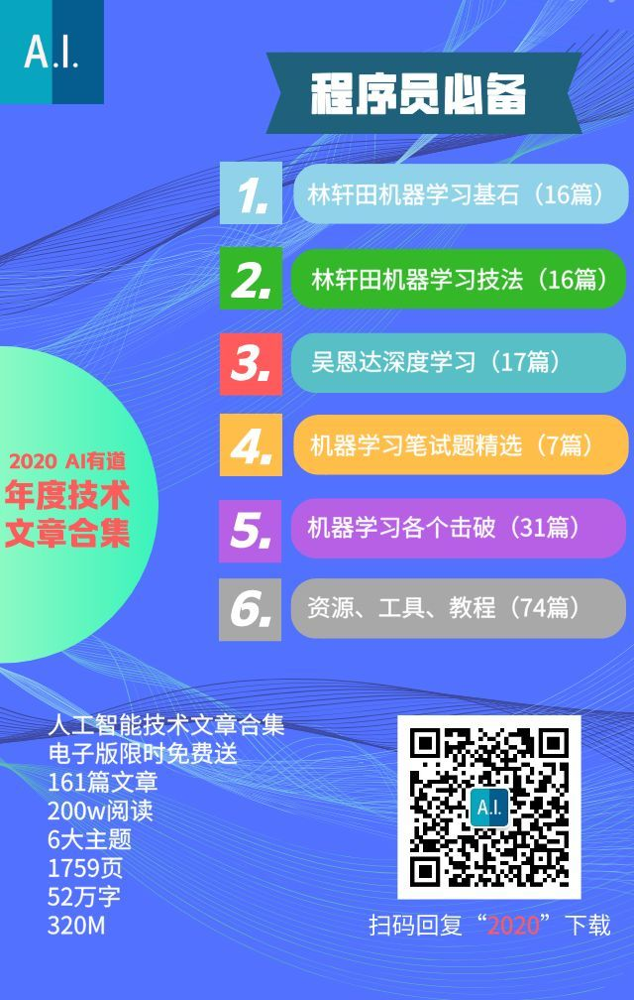

# AI有道

## 持续更新中

如今，AI有道已经陪伴读者两年了。在这段时间里，我们一直专注于人工智能最前沿的技术、干货和资讯，努力为读者呈现最有价值的 AI 信息，致力于为读者提供切实可行的 AI 学习路线。

两年的时间，我们已经发布了超过 160 篇技术干货文章，52 万字，电子版总共 1700 多页。内容包括：林轩田机器学习，吴恩达深度学习专项课程，机器学习笔试题，机器学习知识点各个击破，AI 资源、工具、教程等 6 大主题。

每一篇文章都是我们精心打磨和撰写的，往往一篇技术文章要写两三天。相信这些文章能够或多或少给读者带来一些帮助。

为了让 AI 知识得到传播，为了让读者更方便地阅读这些文章，红色石头特意将 2020 年 AI有道原创文章进行了整理和打包，制作了电子版合集。共 6 大主题，161 篇精选文章，1759 页，52 万字，320M，有超过 400,000 次的阅读。整个电子书阅读包含标签、目录，非常方便。
